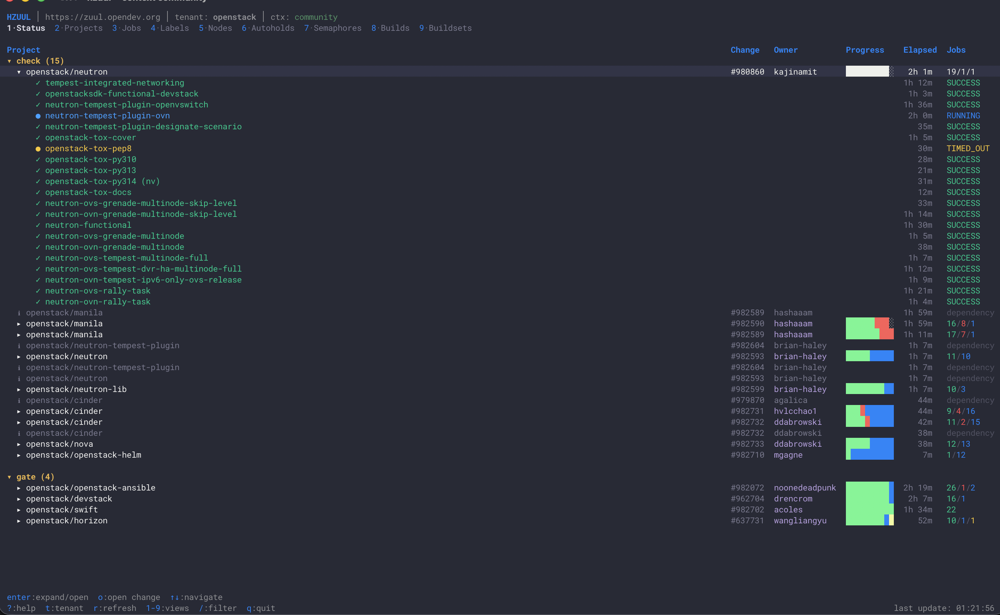
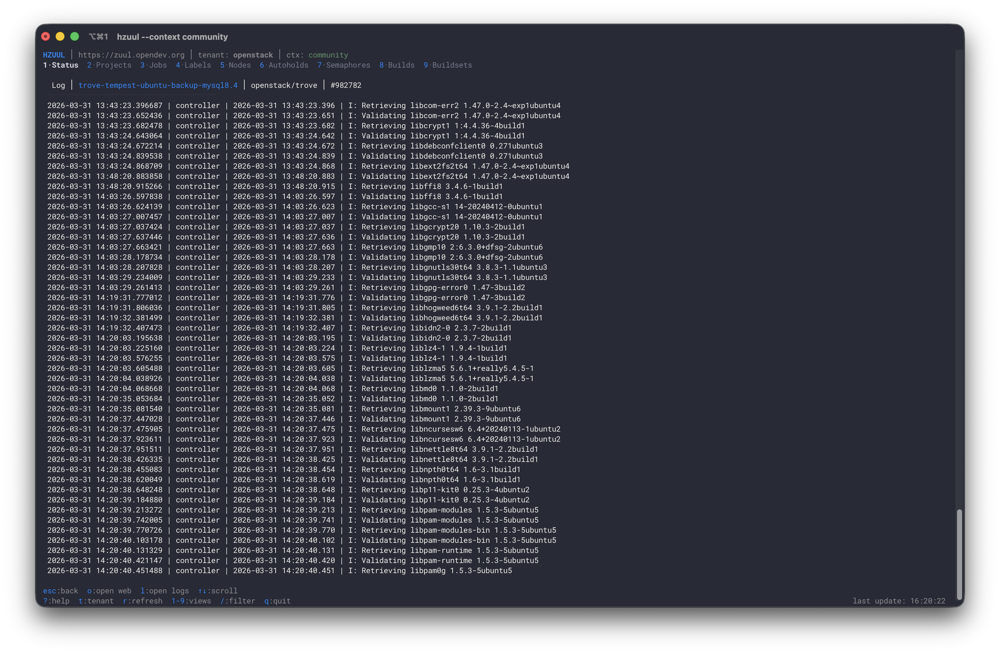

# HZUUL

Terminal User Interface for [Zuul CI/CD](https://zuul-ci.org/).

Monitor pipelines, browse builds, stream logs, and manage your Zuul instance — all from the terminal.





## Features

- **Status Dashboard** — Pipeline cards with color-coded build status (like the web UI)
- **All Views** — Projects, Jobs, Labels, Nodes, Autoholds, Semaphores, Builds, Buildsets, Downloads
- **Build Detail** — Full build info with log streaming via WebSocket
- **Download Logs** — Download full build logs to disk with concurrent workers, background progress, and persistent history
- **Tenant Picker** — Switch between tenants on the fly
- **Kerberos Auth** — SPNEGO authentication for enterprise Zuul instances
- **Multi-Instance** — Config profiles for multiple Zuul deployments (like kubeconfig)
- **Auto-Refresh** — Views refresh every 30 seconds
- **Keyboard-Driven** — vim-style navigation, no mouse needed

## Install

### Quick install

```bash
curl -fsSL https://raw.githubusercontent.com/Valkyrie00/hzuul/main/install.sh | bash
```

Downloads the latest release for your platform (macOS/Linux, amd64/arm64), verifies the checksum, and installs to `/usr/local/bin`.

### From source

```bash
go install github.com/Valkyrie00/hzuul/cmd/hzuul@latest
```

### Build locally

```bash
git clone https://github.com/Valkyrie00/hzuul.git
cd hzuul
make build
./bin/hzuul
```

## Configuration

HZUUL uses a YAML config at `~/.hzuul/config.yaml`.

On first run without a config, HZUUL defaults to `zuul.opendev.org` (public, no auth).

### Public instances (no auth required)

```yaml
current_context: opendev

contexts:
  opendev:
    url: https://zuul.opendev.org
    tenant: openstack

  opendev-zuul:
    url: https://zuul.opendev.org
    tenant: zuul
```

### Private instance with Kerberos

```yaml
current_context: my-zuul

contexts:
  my-zuul:
    url: https://zuul.internal.example.com
    tenant: my-tenant
    auth: kerberos
    verify_ssl: true
    ca_cert: /path/to/ca-bundle.pem   # optional, for internal CAs
```

```bash
kinit                # get your Kerberos ticket
hzuul                # HZUUL picks it up automatically
```

### Multi-instance example

```yaml
current_context: my-zuul

contexts:
  my-zuul:
    url: https://zuul.internal.example.com
    tenant: my-tenant
    auth: kerberos

  opendev:
    url: https://zuul.opendev.org
    tenant: openstack
```

Switch context via `--context`:

```bash
hzuul --context opendev
```

## Keybindings

| Key           | Action                    |
| ------------- | ------------------------- |
| `1`-`9`, `0`  | Switch to view (0=Downloads) |
| `Tab`         | Next view                 |
| `Shift+Tab`   | Previous view             |
| `r`           | Refresh current view      |
| `t`           | Change tenant             |
| `Enter`       | Open detail               |
| `l`           | Stream log (Builds view)  |
| `d`           | Download logs (Build detail) |
| `q` / `Esc`   | Quit / Back               |
| `?`           | Help                      |

## Download Logs

Press `d` in any build detail view to download the full build logs to disk.

- A path prompt appears pre-filled with `~/.hzuul/logs/<tenant>/<uuid>/`
- Downloads run in the background — navigate away while they complete
- The **Downloads** tab (`0`) shows all active and past downloads with status, progress, and size
- History is persisted in `~/.hzuul/history.json` across sessions
- 10 concurrent workers for fast throughput

| Key (Downloads view) | Action              |
| -------------------- | ------------------- |
| `d`                  | Remove from history |
| `x`                  | Cancel active download |
| `o`                  | Open download directory |

## CLI Flags

```
--config <path>    Config file (default: ~/.hzuul/config.yaml)
--context <name>   Use a specific context
--version          Show version
```

## Requirements

- Go 1.22+ (to build)
- A Zuul instance with REST API enabled
- For Kerberos auth: valid `kinit` ticket and `/etc/krb5.conf`

## License

Apache License 2.0 — see [LICENSE](LICENSE) for details.
