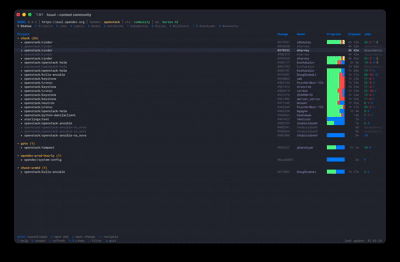

# HZUUL

Terminal User Interface for [Zuul CI/CD](https://zuul-ci.org/).

Monitor pipelines, browse builds, stream logs, and manage your Zuul instance — all from the terminal.

<p align="center">
  
</p>

## ✨ Features

- **Status Dashboard** — Pipeline cards with color-coded build status
- **All Views** — Projects, Jobs, Labels, Nodes, Autoholds, Semaphores, Builds, Buildsets, Downloads
- **Build Detail** — Full build info with log streaming via WebSocket
- **Download Logs** — Background downloads with concurrent workers, progress tracking, and persistent history
- **Tenant Picker** — Switch between tenants on the fly
- **Kerberos Auth** — SPNEGO authentication for enterprise Zuul instances
- **Multi-Instance** — Config profiles for multiple Zuul deployments (like kubeconfig)
- **AI Analysis** *(Experimental)* — Build failure diagnosis with Claude and Gemini
- **Admin Actions** — Dequeue and promote builds (with auth)
- **Bookmarks** — Save builds for quick access
- **Auto-Refresh** — Views refresh every 30 seconds
- **Keyboard-Driven** — Vim-style navigation, no mouse needed

## 🚀 Quick Install

```bash
curl -fsSL https://raw.githubusercontent.com/Valkyrie00/hzuul/main/install.sh | bash
```

> Downloads the latest release for your platform (macOS/Linux, amd64/arm64), verifies the checksum, and installs to `/usr/local/bin`.

<details>
<summary>Other installation methods</summary>

### From source

```bash
go install github.com/Valkyrie00/hzuul/cmd/hzuul@latest
```

### Build locally

```bash
git clone https://github.com/Valkyrie00/hzuul.git
cd hzuul
make build
./bin/hzuul
```

</details>

## ⚙️ Configuration

HZUUL uses a YAML config at `~/.hzuul/config.yaml`. On first run without a config, it defaults to `zuul.opendev.org` (public, no auth).

### Basic usage

```yaml
current_context: opendev

contexts:
  opendev:
    url: https://zuul.opendev.org
    tenant: openstack
```

### Kerberos and multi-instance

```yaml
current_context: my-zuul

contexts:
  my-zuul:
    url: https://zuul.internal.example.com
    tenant: my-tenant
    auth: kerberos

  opendev:
    url: https://zuul.opendev.org
    tenant: openstack
```

```bash
kinit                       # get your Kerberos ticket
hzuul                       # picks it up automatically
hzuul --context opendev     # switch context
```

## 📥 Download Logs

Press `d` in any build detail view to download the full build logs to disk.

- Path prompt pre-filled with `~/.hzuul/logs/<context>/<tenant>/<uuid>/`
- Downloads run in the background — navigate away while they complete
- The **Downloads** tab (`0`) tracks all active and past downloads
- History persisted in `~/.hzuul/downloads.json` across sessions
- 10 concurrent workers for fast throughput

| Key | Action                              |
| --- | ----------------------------------- |
| `d` | Delete download (removes log files) |
| `x` | Cancel active download              |
| `o` | Open download directory             |
| `a` | AI analysis on downloaded logs      |

## 🔍 Filtering & Search

Press `/` from any view to open the filter bar. Type your query and press `Enter` to apply, `Esc` to clear.

### Server-side filters (Builds & Buildsets)

Builds and Buildsets support structured `key:value` filters that query the Zuul API directly:

| Filter | Example | Description |
| --- | --- | --- |
| `job:` | `job:tox-py312` | Filter by job name |
| `project:` | `project:openstack/nova` | Filter by project |
| `pipeline:` | `pipeline:check` | Filter by pipeline |
| `branch:` | `branch:master` | Filter by branch |
| `result:` | `result:FAILURE` | Filter by build result |
| `change:` | `change:123456` | Filter by change number |
| `uuid:` | `uuid:abc123...` | Jump directly to a specific build |

**Smart defaults** — If you type without a `key:` prefix, the filter is applied automatically based on context:
- Text containing `/` is treated as a **project** (e.g. `openstack/nova`)
- Anything else is treated as a **job name** (Builds) or **pipeline** (Buildsets)

### Client-side filters (other views)

Projects, Jobs, Labels, Nodes, Autoholds, and Semaphores filter in-memory with live results as you type — no `Enter` needed.

## 🤖 AI Analysis (Experimental)

Press `a` in any build detail or downloaded logs view to get an instant AI-powered diagnosis.

| Provider           | Config `provider` | Auth                 |
| ------------------ | ----------------- | -------------------- |
| Claude (Anthropic) | `anthropic`       | API key              |
| Claude (Vertex AI) | `vertex`          | `gcloud` credentials |
| Gemini (AI Studio) | `gemini`          | API key              |
| Gemini (Vertex AI) | `gemini-vertex`   | `gcloud` credentials |

### Setup

Add one of the following to `~/.hzuul/config.yaml`:

<details>
<summary>Anthropic API</summary>

```yaml
ai:
  provider: anthropic
  anthropic_api_key: sk-ant-...
```
</details>

<details>
<summary>Vertex AI (Claude)</summary>

```yaml
ai:
  provider: vertex
  vertex_project_id: my-gcp-project
  vertex_region: us-east5
```
</details>

<details>
<summary>Gemini (AI Studio)</summary>

```yaml
ai:
  provider: gemini
  gemini_api_key: AIza...
```
</details>

<details>
<summary>Gemini (Vertex AI)</summary>

```yaml
ai:
  provider: gemini-vertex
  vertex_project_id: my-gcp-project
  vertex_region: us-central1
```
</details>

Set `provider: auto` (or omit it) to let HZUUL pick the first available provider.

### How it works

- **Quick Analysis** (`a` from build detail) — analyzes build metadata and task failures from the API
- **Full Analysis** (`a` from downloaded logs) — reads the complete log files for deeper context
- Streaming responses with follow-up questions supported
- No data leaves your machine unless you explicitly configure an AI provider

## 🔧 CLI Flags

| Flag               | Description                                  |
| ------------------ | -------------------------------------------- |
| `--config <path>`  | Config file (default: `~/.hzuul/config.yaml`)|
| `--context <name>` | Use a specific context                       |
| `--version`        | Show version                                 |

## Requirements

- Go 1.22+ (to build)
- A Zuul instance with REST API enabled
- For Kerberos auth: valid `kinit` ticket and `/etc/krb5.conf`

## 📄 License

Apache License 2.0 — see [LICENSE](LICENSE) for details.
